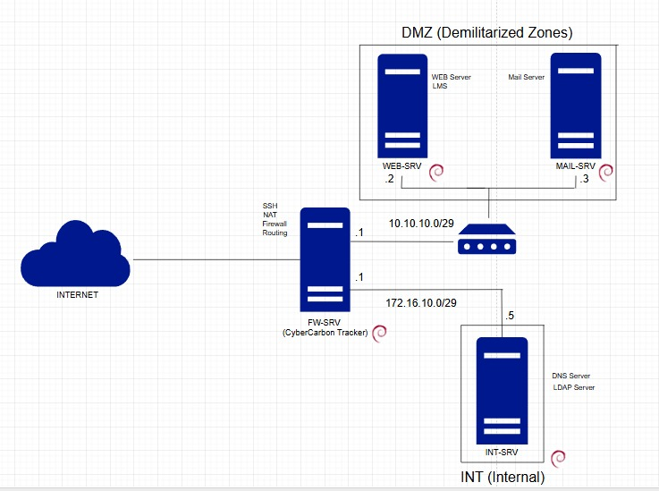

# NetCarbon Tracker
> A Python-based Server Resource & Carbon Emission Monitoring System  
> Supporting **SDGs 9, 12, and 13** — Innovation, Responsible Consumption, and Climate Action.

---

## Overview
**NetCarbon Tracker** adalah aplikasi berbasis Python yang digunakan untuk memantau
penggunaan sumber daya server (CPU & RAM) dan mengestimasi emisi karbon digital yang dihasilkan
berdasarkan konsumsi energi.

Proyek ini dikembangkan oleh mahasiswa **Teknologi Rekayasa Internet (TRI)** sebagai integrasi antara:
- Bidang *Networking & Sysadmin*
- Prinsip efisiensi energi digital
- Tujuan pembangunan berkelanjutan (*Sustainable Development Goals*)

---

## System Components
| Server | IP Address | Role |
|---------|-------------|------|
| FW-SRV | 10.10.10.1 / 172.16.10.1 | Firewall & Monitoring Host |
| WEB-SRV | 10.10.10.2 | Web Server (LMS / Apache2) |
| MAIL-SRV | 10.10.10.3 | Mail Server (Postfix / Roundcube) |
| INT-SRV | 172.16.10.5 | DNS Server / LDAP |

---

## Features
- SSH-based monitoring (Key Authentication)
- CPU & RAM utilization tracking
- Power usage & CO₂ emission estimation
- CLI-based tabular report (Python text interface)
- Lightweight modular structure (no GUI required)

---

## Python Learning Outcomes (Materi Praktikum Prokom)
| Materi | Implementasi |
|--------|---------------|
| Variables & Data Types | Perhitungan CPU, RAM, Power, dan CO₂ |
| Conditional Statements | Validasi nilai & pengambilan keputusan |
| Loops | Iterasi pengambilan data server |
| Dictionary & Lists | Struktur data utama hasil monitoring |
| Functions | Pembagian proses modular |
| Modular Programming | Pemisahan file `collector.py`, `calc.py`, `tampilan.py` |
| Matrix Operation | Penjumlahan total energi dan emisi |
| Input/Output | Hasil monitoring ditampilkan via terminal |

---

## System Architecture

---

## Setup Documentation
- [SERVER_SETUP_GUIDE.md](docs/SERVER_SETUP_GUIDE.md)  
- [NETWORK_CONFIGURATION.md](docs/NETWORK_CONFIGURATION.md)

---

## SDGs Alignment
| SDG | Relevansi |
|-----|------------|
| **SDG 9: Industry, Innovation, and Infrastructure** | Pengembangan sistem monitoring digital berbasis Python. |
| **SDG 12: Responsible Consumption and Production** | Mendorong efisiensi sumber daya digital (CPU/RAM/power). |
| **SDG 13: Climate Action** | Estimasi emisi karbon dari konsumsi energi server. |

---

## Project Team
Muhammad Daffa Izdihar	      	(25/560183/SV/26399) 	(Project Manager)
Ali Sajjad Makarim		          (25/566079/SV/27031)	(Programmer)
Muhammad Arkhan Rosangga Putra	(25/566316/SV/27063)	(System Designer)
Alesha Khairunisa		            (25/564808/SV/26870)	(System Analyst)

---

## License
This project is released under the [MIT License](LICENSE).

---
> 📅 Last updated: November 2025  
> 🧑‍💻 Maintained by: NetCarbon Tracker Team
